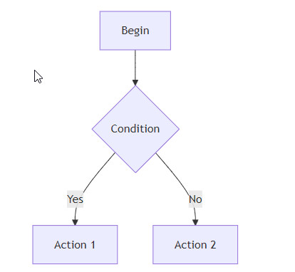

## Version History

### Markdown RU 0.1.12-ru.9

* Add persistent 1-8 parallel translation requests for CLI and API, defaulting to one whole-document request.
* Split long Markdown at conservative block boundaries, provide neighboring source context, and assemble only target translations in source order.
* Show completed/total fragment progress; cancel all workers on failure and cache only complete translations.
* Resolve Codex isolation once per document and retain per-request timeouts and existing credential/proxy policies.
* Cover Markdown boundaries, concurrent CLI/API transports, stable assembly, cancellation and settings persistence with regression tests.

### Markdown RU 0.1.12-ru.8

* Add per-API system/direct/custom HTTP and SOCKS5 proxy settings, explicit authentication, remote/local SOCKS DNS and DPAPI-protected proxy credentials.
* Invalidate cached API translations when the output-token parameter changes.
* Report failed INI writes and apply accepted settings to the active preview even when persistence fails.
* Reload maximum-length text fields without an INI buffer-boundary exception.
* Use Unicode Windows profile APIs for settings paths and add native Unicode and maximum-length save/read checks.
* Send DeepSeek Harness documents over stdin so official Windows batch launchers accept multiline Markdown and long prompts.
* Add regression checks for API cache invalidation and native INI write failures.
* Handle JSON null fields in standard Responses/Gemini replies and token-budget diagnostics.
* Keep startup working when API settings are damaged or locked; preserve unreadable originals separately from rolling backups.
* Save unrelated preview/CLI options when API persistence fails, and remove rolling credential backups after clearing or deleting secrets.
* Reject credentials embedded in endpoint URLs before storage or requests, and use Anthropic's temperature range.
* Preserve CLI argument quotes across INI save/reload and reject templates exceeding the native storage boundary before writing.
* Refresh unchanged preview content after synchronization changes; ignore stale scroll events when synchronization is disabled.
* Save preview settings before a translator is configured, expand resource-path variables, and fit the settings window to the available screen area.
* Create new INI files in Unicode; preserve existing ANSI encoding and report unsupported characters instead of silently replacing them.
* Pin build dependencies to verified upstream digests and validate cached archives and extracted files before reuse.
* Show simple model names, merge Cursor reasoning variants behind effort, and retain exact advertised aliases when restoring saved choices.
* Preserve the selected API endpoint when preview-only settings are saved after a transient API catalog load failure.
* Translate all Markdown extension descriptions into Russian while retaining their original identifiers.
* Start CLI processes suspended and assign their entire process trees before execution; use independent BOM-free UTF-8 pipes.
* Apply provider environment policies using the selected CLI profile even for renamed executables.
* Send AGY prompts over documented JSON stdin and exclude unsupported Kimi batch launchers from automatic profiles.

### Markdown RU 0.1.12-ru.7

* Rename the plugin UI to AnotherMarkdown + Translate-RU; show the fork URL and retain upstream credits.
* Update the installed Help/README with translation, CLI/API setup and current model/effort behavior.
* Replace the stretched legacy artwork with a square vector mark, native icon sizes from 16 to 256 pixels, and light/dark toolbar variants.

### Markdown RU 0.1.12-ru.6

* Group Cursor effort aliases even when their display names omit the effort; hide Fast variants.
* Sort CLI and API model selectors alphabetically while preserving the saved choice.
* Let API services choose the output budget by default, avoiding an artificial 8192-token cap on reasoning and translation. Anthropic retains its required explicit limit.
* Distinguish exhausted token budgets, model refusals, tool calls and incomplete responses without displaying partial translations or sensitive server output.

### NppAnotherMarkdown 0.1.12 (released 2026-08-17)
* added support mermaid plugin (thanks to @MassimilianoPili)  
 

will produce diagram:   

### NppAnotherMarkdown 0.1.7 (released 2026-01-20)

* rewrite all client-side code from plain JavaScript to TypeScript
* panoramic image add ability to display it without scene definition
* fix: reduce text flickering in the main editor window when synchronizing checklist checkboxes

### NppAnotherMarkdown 0.1.6 (released 2026-01-15)

- Support drag-and-drop and CTRL+V insert images into markdown preview.  
Markup `` inserted into current cursor position. 
Image naming is starts from 010.ext and incrementing with step 5, ie 010.jpg 015.jpg, 020.jpg, and each image stored in folder "./img" where markdown document located.  
Location can be changed by edit [assets/markdown/markdown.js]().

- Added navigation over existing Markdown files when clicking a link to such a file in the preview window; previous behavior: such navigation was ignored.
- Preserve preview position after switch between documents
- highlight.js: code syntax highlight plugin added. Enable it via settings  

### NppAnotherMarkdown 0.1.5 (released 2026-01-12)
* Markdown Plugin Pack added

| plugin        | description |
|---------------|-------------|
| [abbr](https://mdit-plugins.github.io/abbr.html)               | Support abbreviation tag \<abbr\> |
| [alert](https://mdit-plugins.github.io/alert.html)             | GFM style alerts |
| [align](https://mdit-plugins.github.io/align.html)             | Plugin to align contents |
| [attrs](https://mdit-plugins.github.io/attrs.html)             | Add attrs to Markdown content |
| [container](https://mdit-plugins.github.io/container.html)     | Creating block-level custom containers |
| [dl](https://mdit-plugins.github.io/dl.html)                   | Definition list |
| [emoji](https://github.com/markdown-it/markdown-it-emoji)      | Emoji |
| [figure](https://mdit-plugins.github.io/figure.html)           | Generating figures with captions from images |
| [footnote](https://mdit-plugins.github.io/footnote.html)       | Footnotes |
| [icon](https://mdit-plugins.github.io/icon.html)               | Icons |
| [imgLazyLoad](https://mdit-plugins.github.io/img-lazyload.html)| Lazy loading for images |
| [imgMark](https://mdit-plugins.github.io/img-mark.html)        | Mark images by ID suffix for theme mode |
| [imgSize](https://mdit-plugins.github.io/img-size.html)        | Support setting size for images |
| [ins](https://mdit-plugins.github.io/ins.html)                 | Аdd \<insert\> tag support |
| [katex](https://mdit-plugins.github.io/katex.html)             | Math Expressions   |
| [mark](https://mdit-plugins.github.io/mark.html)               | Mark and highlight contents |
| [plantuml](https://mdit-plugins.github.io/plantuml.html)       | Support plant uml schemes |
| [ruby](https://mdit-plugins.github.io/ruby.html)               | Ruby annotation \<ruby\> |
| [spoiler](https://mdit-plugins.github.io/spoiler.html)         | Plugin to hide content |
| [stylize](https://mdit-plugins.github.io/stylize.html)         | Plugin for stylizing tokens |
| [sub](https://mdit-plugins.github.io/sub.html)                 | Plugin to support subscript |
| [sup](https://mdit-plugins.github.io/sup.html)                 | Plugin to support superscript |
| [tab](https://mdit-plugins.github.io/tab.html)                 | Block-level custom tabs |

### NppAnotherMarkdown 0.1.4 (released 2026-01-08)
* Syncing view for both window (text and markdown preview) when "Sync with first visible line" enabled.  

### NppAnotherMarkdown 0.1.3 (released 2026-01-06)
* Editable tasklists, (bi-direction sync)

Fixes:
- [x] fix: reduce flickering panorama during text editing
- [x] fix: another attempt to make more accurate positioning in the viewer when changing the caret position or the first line  

### NppAnotherMarkdown 0.1.2 (released 2026-01-03)
Fixes:
- [x] minor, but possible memory leaks

### NppAnotherMarkdown 0.1.1 (released 2025-12-30)
* Scene editor for 360 panoramic photos.
* 360 pano scene example  

Fixes:
- [x] some memory leaks
- [x] scrolling, positioning in the viewer when changing the caret position

### NppAnotherMarkdown 0.1.0 (released 2025-12-26)
* Removed support for IE11
* Removed support for the MarkdownDig library
* Markdown rendering using the [markdown-it](https://github.com/markdown-it/markdown-it) library
* Added markup for displaying panoramic photos: ``
* Added markup for displaying QR codes: ``
* More accurate positioning in the viewer when changing the caret position or the first line
