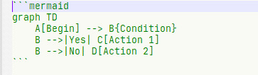

# AnotherMarkdown + Translate-RU

**Версия форка: 0.1.12-ru.7.** Предпросмотр Markdown и перевод на русский в Notepad++.

[Репозиторий форка](https://github.com/maljaev-alex/markdown-ru) ·
[Сборки и изменения RU](https://github.com/maljaev-alex/markdown-ru/releases) ·
[Подробная справка по переводу](docs/translation-ru.md) ·
[Сообщить о проблеме](https://github.com/maljaev-alex/markdown-ru/issues)

Проект основан на [AnotherMarkdown от ezyuzin](https://github.com/ezyuzin/NppAnotherMarkdown),
версия 0.1.12. Upstream разработал панель предпросмотра на WebView2 и интеграцию
Markdown-расширений. Этот форк добавляет перевод через CLI/API, русские настройки
перевода и поддержку `.mdc`. Сохранены авторство upstream, ресурсы рендерера и лицензия MIT.

## Что умеет плагин

- Показывает `.md` и `.mdc` в панели Notepad++ через **Microsoft Edge WebView2**.
- Рендерит таблицы, подсветку кода, формулы, Mermaid и другие расширения Markdown.
- Переводит документ на русский через установленный CLI или сохранённое API-подключение.
- Получает списки моделей, сортирует их по имени и позволяет выбрать доступный effort.
- Сохраняет несколько API-подключений; CLI и API настраиваются независимо.
- Показывает перевод только в предпросмотре. Исходный буфер и файл сохраняют свой текст.

## Установка и обновление

Требуются **Windows, 64-битный Notepad++, .NET Framework 4.7.2 или новее**
и [Microsoft WebView2 Runtime](https://developer.microsoft.com/microsoft-edge/webview2/).
Сборка RU предназначена для x64; разрядность плагина должна совпадать с Notepad++.

1. Скачайте `AnotherMarkdown-0.1.12-ru.7-x64.zip` из
   [релизов этого форка](https://github.com/maljaev-alex/markdown-ru/releases).
2. Закройте Notepad++ и сохраните резервную копию прежней папки плагина.
   Если меняли CSS или assets, сохраните свои версии отдельно.
3. Распакуйте содержимое архива в `Notepad++\plugins\AnotherMarkdown`,
   например `C:\Program Files\Notepad++\plugins\AnotherMarkdown`.
4. Запустите Notepad++. В меню **Плагины** появится **AnotherMarkdown + Translate-RU**.

`AnotherMarkdown.dll`, `lib`, `assets` и `README.md` должны находиться непосредственно
в папке `AnotherMarkdown`, без дополнительной вложенной папки из архива.
Имя DLL, каталог установки и `AnotherMarkdown.ini` сохранены для совместимости.

Если Windows заблокировала загруженные DLL, откройте их свойства и нажмите
**Разблокировать**, включая DLL в `lib`. При ошибке совместимости также проверьте
разрядность Notepad++, наличие .NET Framework и WebView2 Runtime.


Plugin Admin устанавливает upstream AnotherMarkdown. Обновление через него может
заменить эту сборку версией без перевода; для обновления RU используйте релизы форка.
Для отката закройте редактор и восстановите резервную копию папки плагина.

## Быстрый старт

1. Откройте сохранённый `.md` или `.mdc` и нажмите значок Markdown на панели
   инструментов Notepad++. Повторное нажатие скрывает предпросмотр.
2. Откройте **Плагины → AnotherMarkdown + Translate-RU → Настройки → Перевод**
   или нажмите **Настройки перевода** в панели.
3. Выберите способ подключения **CLI** либо **API**, настройте модель и нажмите **Сохранить**.
4. Нажмите **Перевести**. **Оригинал** возвращает исходный предпросмотр,
   **Отмена** прерывает выполняющийся запрос.

Вращающийся значок означает ожидание ответа, а не процент готовности.
При изменении текста, переходе к другому документу или отмене старый результат
не подменяет новый предпросмотр. Для CLI отмена завершает запущенный процесс
и его дочерние процессы. Для API прекращается ожидание в плагине; обработка
на сервере и учёт запроса зависят от самого сервиса.

Переведённая панель работает в режиме чтения: чекбоксы, вставка изображений
и синхронизация строк с редактором в ней отключены.
Повторный запрос того же текста с теми же параметрами использует кэш в памяти:
до **8 результатов / 4 млн символов перевода** суммарно. Кэш не записывается на диск
и исчезает при завершении работы плагина.

В YAML front matter инструкция модели переводит описательные значения
`description`, `title` и `summary`, включая многострочные. Ключи, `name`,
идентификаторы, пути, globs и флаги требуется сохранять.
Это перевод текста правила, а не выполнение содержащихся в нём инструкций.

## Перевод через CLI

Сначала установите и авторизуйте нужный CLI по его официальной документации.
Плагин находит существующие установки в `PATH` и обычных каталогах; сам CLI не устанавливает.
В **Выбрать…** можно указать `.exe` или штатный Windows-запускатель `.cmd` / `.bat`.
Диалог начинает поиск в каталоге текущего CLI. На каждый профиль показывается
одна установка; при наличии нативного EXE он имеет приоритет.

| Профиль | Откуда берётся список моделей |
| --- | --- |
| [Codex CLI](https://learn.chatgpt.com/docs/non-interactive-mode) | `app-server`: `model/list` и настроенная модель из `config/read` |
| [Cursor Agent](https://cursor.com/docs/cli/overview) | `agent models` |
| [Claude Code](https://code.claude.com/docs/en/cli-reference) | Настроенная в CLI модель или ручной ID |
| [Gemini CLI](https://geminicli.com/docs/cli/headless/) | Настроенная в CLI модель или ручной ID |
| [OpenCode](https://opencode.ai/docs/cli/) | `opencode models` |
| [Ollama](https://docs.ollama.com/cli) | `ollama list`, только уже установленные модели |
| [DeepSeek Harness](https://github.com/deepseek-ai/deepseek-harness/tree/master/apps/cli/reference) | Модель из профиля самого DSH |
| [Qwen Code](https://qwenlm.github.io/qwen-code-docs/en/users/features/headless/) | Настроенная в CLI модель или ручной ID |
| [Kimi Code](https://www.kimi.com/code/docs/en/kimi-code-cli/reference/kimi-command.html) | `provider list --json`, алиасы моделей |
| [Antigravity CLI](https://antigravity.google/docs/cli/headless/) | `agy models` |
| [GitHub Copilot CLI](https://docs.github.com/en/copilot/reference/copilot-cli-reference/cli-programmatic-reference) | Настроенная в CLI модель или ручной ID |

При смене CLI сразу применяются его стандартные параметры и запрашиваются модели.
**Настройки по умолчанию** сбрасывает параметры выбранного CLI, включая тайм-аут 300 секунд.

Модели отсортированы по имени; **Модель по умолчанию в CLI** стоит первой.
Для большинства CLI этот вариант оставляет выбор модели самому CLI.
Ollama требует конкретную установленную модель и использует первую из полученного списка.
В начальной конфигурации Codex указана `gpt-6-astra`; её можно сменить.

**Усилие (effort)** для Codex берётся из метаданных модели, для Cursor — из реально
объявленных вариантов. Например, Grok 4.7 с Extra High передаёт `grok-4.7-xhigh`.
Вариант по умолчанию использует настоящий ID CLI; уровни не выдумываются.
Модели Cursor объединяются по effort; Thinking и явно разные контексты остаются
отдельными вариантами. Варианты скорости с суффиксом `-fast` скрыты.
Сохранённый Fast заменяется только найденным обычным аналогом; если его нет,
выбирается модель CLI по умолчанию.

**Дополнительные параметры** раскрывает тип CLI, тайм-аут, ручной ID модели,
аргументы запуска и формат ответа. Собственные аргументы включаются отдельным флажком.
В этом режиме за их совместимость отвечает пользователь.

Живые проверки проводились с Codex и Cursor. Остальные профили реализованы по
официальной документации; совместимость зависит от установленной версии CLI.
Подробности запуска и ограничений находятся в [справке по переводу](docs/translation-ru.md).

## Перевод через API

В настройках перевода выберите **API** и добавьте подключение кнопкой **+**.
Укажите название, сервис/протокол, адрес, ключ и модель.
Сохранённые подключения можно переключать независимо от CLI.

Поддерживаются **OpenAI-совместимый Chat Completions, OpenAI Responses,
Anthropic Messages и Google Gemini Generate Content**. Есть пресеты OpenAI,
DeepSeek, OpenRouter, Anthropic, Gemini и локальных Ollama/LM Studio.
Можно указать свой базовый URL или полный адрес операции.
Выбор другого пресета очищает ключ и модель текущего черновика;
для отдельного подключения сначала нажмите **+**.

**Модели** запрашивает каталог сервера и сортирует его по имени.
Если каталога нет, введите ID вручную. **Проверить подключение** отправляет
короткий пример выбранной модели и использует обычные лимиты API.
Для локального сервера ключ может быть пустым.

В дополнительных параметрах доступны effort, temperature, лимит ответа,
поле лимита Chat Completions, заголовок/префикс ключа и дополнительные JSON-поля.
Поддержка effort и temperature зависит от модели; `/models` обычно её не описывает.

**Лимит ответа 0 — по умолчанию сервиса.** Он используется для новых подключений
Chat Completions, Responses и Gemini. Anthropic требует явный положительный
`max_tokens`; его пресет задаёт **8192**.
Рассуждения могут расходовать тот же бюджет, что и текст перевода.
При исчерпании лимита плагин показывает ошибку и доступные счётчики токенов.
Увеличьте бюджет или уменьшите effort; автоматических повторных запросов нет.
Обрезанный ответ API не выдаётся за завершённый перевод.

Профили хранятся в `AnotherMarkdown.ini.api.json` рядом с INI плагина.
Ключи и дополнительные HTTP-заголовки шифруются **Windows DPAPI для текущего
пользователя**; в INI ключей нет. Адрес, модель и обычные JSON-параметры
не являются хранилищем секретов. После переноса на другую учётную запись
ключи потребуется ввести заново. При сохранении предыдущий JSON остаётся в `.bak`.
**Очистить секреты** применяется после сохранения, **Отмена** отбрасывает правки.
Проверка TLS-сертификатов включена; HTTP-перенаправления не выполняются.

## Настройки предпросмотра

Вкладка **Просмотр** позволяет выбрать каталог ресурсов, CSS обычной и тёмной темы,
масштаб, панель инструментов, строку адресов ссылок и расширения Markdown.
Пустой CSS или каталог ресурсов означает стандартный вариант; **Сбросить**
возвращает его. Перевод использует тот же рендерер, CSS и относительные ссылки.

В меню плагина есть синхронизация предпросмотра с курсором либо первой видимой
строкой редактора. Она действует для оригинала. Тёмная тема следует настройке Notepad++.

## Если что-то не работает

| Ситуация | Что проверить |
| --- | --- |
| Не видны кнопки перевода | Включите **Показывать кнопки перевода в панели** в настройках перевода. |
| `Перевести` недоступно | Откройте непустой сохранённый `.md` или `.mdc` и дождитесь завершения текущего запроса. |
| CLI не найден | Проверьте его установку/авторизацию; нажмите **Найти CLI** или укажите официальный EXE/CMD/BAT через **Выбрать…**. |
| Каталог моделей недоступен | Используйте модель CLI по умолчанию либо ручной ID в дополнительных параметрах; для API ID вводится прямо в поле модели. |
| API вернул HTTP 401/403 | Проверьте ключ, адрес и формат авторизации выбранного сервиса. |
| API исчерпал лимит ответа | Проверьте указанные в ошибке токены, лимит ответа и effort. Короткий тест подключения не проверяет размер полного документа. |
| После обновления пропал перевод | Убедитесь, что установлена сборка этого форка, а не upstream из Plugin Admin. |

Перевод ограничен **1 млн символов исходного текста за запрос**; контекст конкретной
модели может быть меньше. Автоматического разбиения на части нет.
Для CLI, передающих запрос аргументом, дополнительно действует предел командной
строки Windows; он описан в подробной справке.
Сохранение Markdown и технических значений задаётся инструкцией модели,
поэтому важные места стоит сверять через **Оригинал**.

## Расширения Markdown

Рендерер основан на [markdown-it](https://github.com/markdown-it/markdown-it).
Выбор расширений доступен в настройках. Ресурсы JavaScript и `assets/markdown/markdown.js`
можно изменять без пересборки DLL; сохраните свои изменения перед обновлением плагина.

| Расширение | Назначение |
| --- | --- |
| [abbr](https://mdit-plugins.github.io/abbr.html) | Сокращения и тег `abbr` |
| [alert](https://mdit-plugins.github.io/alert.html) | Блоки предупреждений в стиле GitHub |
| [align](https://mdit-plugins.github.io/align.html) | Выравнивание содержимого |
| [attrs](https://mdit-plugins.github.io/attrs.html) | Атрибуты элементов Markdown |
| [container](https://mdit-plugins.github.io/container.html) | Пользовательские блочные контейнеры |
| [dl](https://mdit-plugins.github.io/dl.html) | Списки определений |
| [emoji](https://github.com/markdown-it/markdown-it-emoji) | Emoji |
| [figure](https://mdit-plugins.github.io/figure.html) | Изображения с подписями |
| [footnote](https://mdit-plugins.github.io/footnote.html) | Сноски |
| [highlight.js](https://github.com/highlightjs/highlight.js) | Подсветка синтаксиса кода |
| [icon](https://mdit-plugins.github.io/icon.html) | Значки |
| [imgLazyLoad](https://mdit-plugins.github.io/img-lazyload.html) | Отложенная загрузка изображений |
| [imgMark](https://mdit-plugins.github.io/img-mark.html) | Варианты изображения для разных тем |
| [imgSize](https://mdit-plugins.github.io/img-size.html) | Размеры изображений |
| [ins](https://mdit-plugins.github.io/ins.html) | Добавленный текст |
| [katex](https://mdit-plugins.github.io/katex.html) | Математические формулы |
| [mark](https://mdit-plugins.github.io/mark.html) | Выделение текста |
| pano360 | Интерактивные панорамы на [Pannellum](https://github.com/mpetroff/pannellum): ``; [пример](example/pano/index.md) |
| [plantuml](https://mdit-plugins.github.io/plantuml.html) | Диаграммы PlantUML |
| [mermaid](https://mermaid.js.org/) | Диаграммы из блоков `mermaid`: схемы, последовательности, Gantt и другие |
| [ruby](https://mdit-plugins.github.io/ruby.html) | Аннотации ruby |
| qrcode | QR-коды: `` |
| [spoiler](https://mdit-plugins.github.io/spoiler.html) | Скрываемое содержимое |
| [stylize](https://mdit-plugins.github.io/stylize.html) | Стилизация токенов |
| [sub](https://mdit-plugins.github.io/sub.html) | Нижний индекс |
| [sup](https://mdit-plugins.github.io/sup.html) | Верхний индекс |
| [tab](https://mdit-plugins.github.io/tab.html) | Вкладки внутри документа |




## Справка и сборка

**Плагины → AnotherMarkdown + Translate-RU → Справка** открывает установленный
`README.md` в Notepad++ и показывает его в панели. Подробная справка находится
в `docs/translation-ru.md`; копия `TRANSLATION-RU.md` поставляется рядом с DLL.
**О плагине** показывает сведения о версии и авторах.

Для сборки требуются Windows, Python 3 и Visual Studio Build Tools с MSBuild/Roslyn:

```powershell
powershell -ExecutionPolicy Bypass -File .\build_tools\build-translation.ps1
```

Скрипт получает закреплённые NuGet-зависимости и JS-ресурсы upstream 0.1.12,
собирает x64 DLL, запускает локальные проверки и создаёт ZIP в `Release`.
Кэш сборки находится вне исходников; пути задаются через `-CacheRoot` и `-OutputDirectory`.
Обычные проверки не требуют настоящих API-ключей и не отправляют документы провайдерам.
Отдельные живые проверки описаны в [подробной справке](docs/translation-ru.md).

## Авторы, зависимости и лицензия

Форк: [maljaev-alex/markdown-ru](https://github.com/maljaev-alex/markdown-ru).
Предпросмотр и основа проекта: [ezyuzin/NppAnotherMarkdown](https://github.com/ezyuzin/NppAnotherMarkdown),
который основан на [NppMarkdownPanel](https://github.com/mohzy83/NppMarkdownPanel).

| Компонент | Автор / проект |
| --- | --- |
| [NotepadPlusPlusPluginPack.Net](https://github.com/kbilsted/NotepadPlusPlusPluginPack.Net) | kbilsted |
| [NppMarkdownPanel](https://github.com/mohzy83/NppMarkdownPanel) | mohzy83 |
| [EdgeViewer / WebView2 integration](https://github.com/rg-software/wlx-edge-viewer) | rg-software |
| [WebView2](https://developer.microsoft.com/microsoft-edge/webview2/) | Microsoft |
| [markdown-it](https://github.com/markdown-it/markdown-it) и плагины | Авторы соответствующих проектов |
| [Markdown mark](https://github.com/dcurtis/markdown-mark) | dcurtis |

Проект распространяется по **MIT**; текст лицензии находится в [License.txt](License.txt)
и [исходном репозитории](https://github.com/ezyuzin/NppAnotherMarkdown/blob/master/License.txt).
Авторские уведомления и лицензии включённых библиотек сохраняются.
История базового проекта доступна в [CHANGELOG.md](CHANGELOG.md),
история RU — в [релизах форка](https://github.com/maljaev-alex/markdown-ru/releases).
